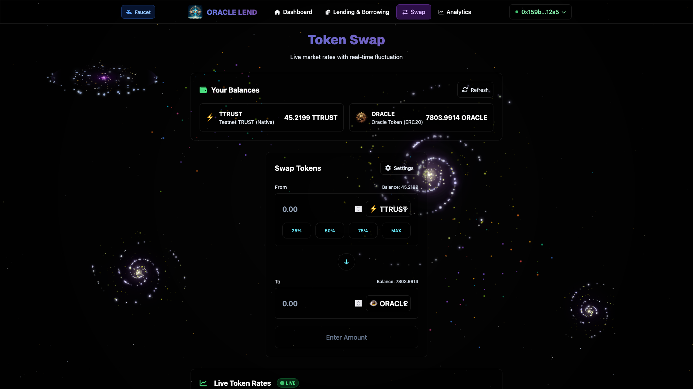

# 👁️Oracle Lend Protocol ✨

<div align="center">

**Advanced DeFi Platform with Lending, Borrowing, and Automated Market Maker**

A sophisticated decentralized finance protocol built on the Intuition blockchain, featuring over-collateralized lending, automated market making, and integrated liquidation systems.

</div>

## Overview

Oracle Lend is a comprehensive DeFi protocol that combines lending/borrowing functionality with an integrated Automated Market Maker (AMM). The platform enables users to supply collateral, borrow against their positions, and trade tokens through the integrated DEX.

## Key Features

- **Over-collateralized Lending**: Supply TTRUST as collateral to borrow ORACLE tokens with 120% collateralization ratio
- **Automated Market Maker**: Constant product AMM for TTRUST/ORACLE trading with price oracle integration
- **Integrated Liquidation System**: 10% liquidation bonus for maintaining protocol health
- **Real-time Analytics**: Live protocol data, position monitoring, and market statistics
- **Mobile Responsive**: Optimized interface for both desktop and mobile devices

## Screenshots

### Dashboard - Portfolio Overview
<div align="center">
<table>
<tr>
<td align="center"><strong>Desktop</strong></td>
<td align="center"><strong>Mobile</strong></td>
</tr>
<tr>
<td align="center"></td>
<td align="center"></td>
</tr>
</table>
</div>

### Lending & Borrowing Interface
<div align="center">
<table>
<tr>
<td align="center"><strong>Desktop</strong></td>
<td align="center"><strong>Mobile</strong></td>
</tr>
<tr>
<td align="center"></td>
<td align="center"></td>
</tr>
</table>
</div>

### DEX/Swap Interface
<div align="center">
<table>
<tr>
<td align="center"><strong>Desktop</strong></td>
<td align="center"><strong>Mobile</strong></td>
</tr>
<tr>
<td align="center"></td>
<td align="center"></td>
</tr>
</table>
</div>

## Technology Stack

- **Frontend**: Vite + React + TypeScript with custom glass-effect design
- **Blockchain**: Direct Ethers.js integration with custom wallet connection
- **Smart Contracts**: OracleToken (ERC20), OracleLend (lending protocol), DEX (AMM)
- **Network**: Custom Intuition testnet
- **Styling**: Tailwind CSS with mobile-responsive design

## Installation & Setup

### Prerequisites
- Node.js (v20.18.3 or later)
- Yarn package manager
- MetaMask wallet extension

### Quick Start

1. **Clone and install dependencies**
```bash
git clone <repository-url>
cd Oracle-Lend/packages/replit
yarn install
```

2. **Configure MetaMask**
Add Intuition testnet to your wallet with the custom RPC configuration.

3. **Start development server**
```bash
yarn dev
```

4. **Access the application**
Navigate to `http://localhost:5173`

## Smart Contracts

- **OracleToken.sol**: Advanced ERC20 implementation
- **OracleLend.sol**: Over-collateralized lending with liquidation system
- **DEX.sol**: Constant product AMM with price oracle functionality

## License

MIT License. See [LICENSE](LICENSE) file for details.

---

**Built with inspiration from Scaffold-ETH 2, enhanced with production-grade DeFi functionality.**

**Disclaimer**: Experimental DeFi software. Use at your own risk.